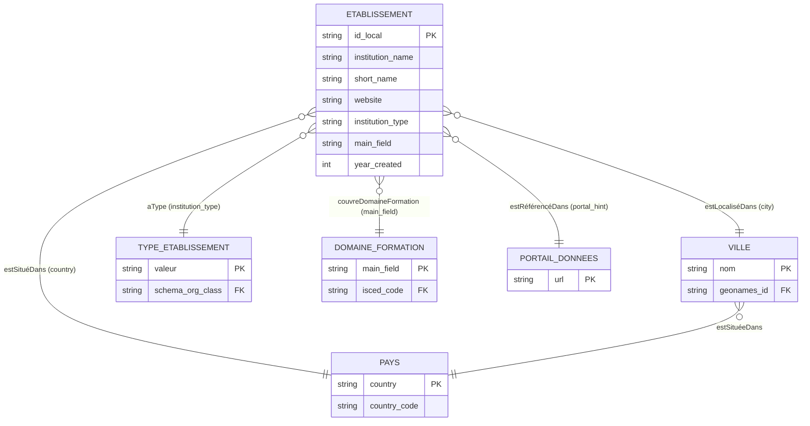

# Carte des entités et des liens potentiels

## 1. Inventaire des entités

| Entité ou type d'entité | Exemple local | Pourquoi s'agit-il d'une entité ? | Attributs associés (champs du CSV) | Identifiant local potentiel |
|---|---|---|---|---|
| Établissement | Ecole Nationale Superieure d'Informatique et d'Analyse des Systemes | Unité institutionnelle distincte avec un nom, un type, une localisation et un site propres | `institution_name`, `short_name`, `institution_type`, `website`, `year_created` | `MA-{short_name}` (ex. `MA-ENSIAS`) |
| Ville | Rabat, Casablanca, Fes, Kenitra, Tetouan, Marrakesh, Agadir | Entité géographique réelle, ancre spatiale de chaque établissement | `city` | GeoNames ID (à ajouter) |
| Pays | Morocco | Contexte national commun à tous les enregistrements | `country` | Code ISO 3166-1 : `MA` |
| Domaine de formation | computer science, engineering, multidisciplinary, civil engineering | Catégorie thématique décrivant la spécialité principale de l'établissement | `main_field` | Code ISCED-F 2013 (à aligner) |
| Type d'établissement | university, faculty, public school, engineering school | Valeur contrôlée décrivant la nature institutionnelle de l'établissement | `institution_type` | Valeur d'un vocabulaire local fermé |
| Site web institutionnel | https://www.ensias.um5.ac.ma | Ressource numérique identifiante, lien direct vers l'établissement | `website` | L'URL elle-même sert d'identifiant potentiel |
| Portail de données | data.gov.ma | Source de données ouverte associée aux établissements | `portal_hint` | URL du portail |
| Année de création | 1957, 1971, 2008 | Repère temporel permettant de situer l'établissement historiquement | `year_created` | Valeur entière (literal RDF de type `xsd:gYear`) |

> Note : `record_id` est présent dans le fichier mais ne constitue pas une entité — c'est un identifiant technique séquentiel sans signification sémantique. `short_name` est un attribut de l'établissement, pas une entité autonome.

---

## 2. Relations conceptuelles observées

| Source | Relation conceptuelle | Cible | Cardinalité | Commentaire |
|---|---|---|---|---|
| Établissement | estLocaliséDans | Ville | N → 1 | Chaque établissement est implanté dans une ville ; plusieurs établissements peuvent partager la même ville (ex. Rabat : ENSIAS, EMI, FSR, UM5) |
| Établissement | estSituéDans | Pays | N → 1 | Tous les établissements visibles sont au Maroc |
| Ville | estSituéeDans | Pays | N → 1 | Relation géographique administrative |
| Établissement | aType | Type d'établissement | N → 1 | `institution_type` : university, faculty, public school, engineering school |
| Établissement | couvreDomaineFormation | Domaine de formation | N → 1 | `main_field` — une valeur par établissement, mais granularité hétérogène |
| Établissement | aÉtéCréé | Année de création | N → 1 | `year_created` — relation temporelle |
| Établissement | aPageWeb | Site web institutionnel | N → 1 | `website` — lien vers la ressource numérique officielle |
| Établissement | estRéférencéDans | Portail de données | N → 1 | `portal_hint` — même valeur pour tous les enregistrements visibles |
| Domaine de formation | peutÊtreAlignéSur | Classification ISCED-F | N → 1 | Lien externe potentiel, non présent dans le dataset |

---

## 3. Liens externes proposés

| Entité locale | Ressource externe candidate | Type de lien envisagé | Critères d'appariement | Justification | Bénéfice attendu | Niveau de confiance | Risque |
|---|---|---|---|---|---|---|---|
| Ecole Nationale Superieure d'Informatique et d'Analyse des Systemes | Wikidata Q3571159 | `owl:sameAs` | Correspondance du nom + ville Rabat + site web `ensias.um5.ac.ma` | Établissement bien documenté sur Wikidata | Enrichissement automatique : date officielle, logo, coordonnées, liens vers d'autres sources | Élevé | Faible — nom distinctif et site vérifiable |
| Universite Mohammed V in Rabat | Wikidata Q217004 | `owl:sameAs` | Correspondance du nom (`short_name` UM5) + ville Rabat + site `um5.ac.ma` | Université publique marocaine de référence, notice Wikidata complète | Accès aux données bilingues, historique, affiliations | Élevé | Faible |
| Cadi Ayyad University | Wikidata Q1055303 | `owl:sameAs` | Correspondance du nom + ville Marrakesh + `short_name` UCA | Nom propre distinctif, notice confirmée | Enrichissement institutionnel | Élevé | Faible |
| Universite Hassan II de Casablanca | Wikidata Q3552327 | `owl:sameAs` | Correspondance du nom + ville Casablanca + `short_name` UH2C + site `univh2c.ma` | Université publique connue | Enrichissement institutionnel | Élevé | Moyen — vérifier que la notice correspond bien à Casablanca et non à l'ex-université de Mohammedia |
| Rabat | GeoNames 2536173 | `owl:sameAs` | Correspondance exacte du nom + code pays MA | Capitale du Maroc, notice GeoNames stable | Coordonnées GPS, hiérarchie administrative, fuseau horaire | Élevé | Faible |
| Casablanca | GeoNames 2553604 | `owl:sameAs` | Correspondance exacte du nom + code pays MA | Ville la plus peuplée du Maroc | Idem | Élevé | Faible |
| Fes | GeoNames 2295420 | `owl:sameAs` | Correspondance du nom (GeoNames utilise "Fes", même forme que le CSV) + code pays MA | Ville universitaire majeure | Idem | Élevé | Faible — le CSV utilise "Fes" qui correspond à la translittération GeoNames |
| computer science (`main_field`) | ISCED-F 2013 — code 0613 | `skos:closeMatch` | Correspondance sémantique avec "Software and applications development and analysis" | Standard UNESCO international pour les domaines de formation | Comparabilité internationale des données | Moyen | Moyen — `computer science` est plus large que le code ISCED correspondant |
| engineering (`main_field`) | ISCED-F 2013 — code 071 | `skos:closeMatch` | Correspondance sémantique avec "Engineering and engineering trades" | Idem | Idem | Moyen | Moyen — `engineering` sans précision couvre plusieurs codes ISCED |
| university (`institution_type`) | schema.org/CollegeOrUniversity | `rdf:type` | Correspondance de classe | Vocabulaire utilisé par les moteurs de recherche | Indexation sémantique, interopérabilité avec schema.org | Élevé | Faible |

---

## 4. Schéma conceptuel

> Les champs entre parenthèses indiquent la colonne du CSV source correspondant à chaque relation. Les clés `geonames_id`, `country_code`, `schema_org_class` et `isced_code` sont des points d'ancrage vers des référentiels externes — ils n'existent pas dans le dataset source et sont à construire.

---

## 5. Analyse critique

**Liens les plus fiables :**
Les correspondances entre les universités nommées (`Universite Mohammed V`, `Cadi Ayyad University`, `Universite Hassan II de Casablanca`) et leurs notices Wikidata peuvent être vérifiées grâce au champ `website`, qui constitue un ancre indépendant. L'alignement des grandes villes sur GeoNames est quasi certain, d'autant que le CSV utilise déjà la translittération anglaise "Fes" qui correspond à la forme GeoNames.

**Liens restant incertains :**
L'alignement de `main_field` sur ISCED-F est approximatif pour toutes les valeurs observées. "multidisciplinary" ne correspond à aucun code ISCED précis. "engineering" sans précision couvre plusieurs codes (071x). Ces liens ne peuvent pas dépasser le niveau `skos:closeMatch` sans information supplémentaire sur les programmes délivrés. Le sigle `UAE` pour Abdelmalek Essaadi University (Tetouan) est ambigu internationalement — un appariement automatique sur ce sigle sans filtre pays produirait des résultats incorrects.

**Informations supplémentaires nécessaires pour automatiser les correspondances :**
Un identifiant ministériel officiel (code MESRSI) éliminerait l'ambiguïté sur tous les établissements. Les coordonnées GPS permettraient une désambiguïsation géographique. Une liste normalisée des domaines ISCED par établissement rendrait l'alignement thématique automatisable.

**Entités devant recevoir un identifiant stable en priorité :**
1. Établissement — entité centrale, actuellement sans identifiant sémantique.
2. Ville — ancre géographique de chaque établissement, en texte libre sans code.
3. Domaine de formation — valeurs trop hétérogènes pour être alignées sans normalisation préalable.

**Risques de faux positifs ou de collisions d'identifiants :**
- `short_name` `UAE` collision avec l'abréviation courante des Émirats Arabes Unis.
- Plusieurs établissements partageant la même ville et un nom partiellement similaire (ex. deux "Ecole Nationale" à Rabat) seraient difficiles à distinguer par correspondance textuelle seule.
- Le champ `website` est le meilleur discriminant, mais des URL peuvent expirer ou changer de domaine, ce qui fragilise un identifiant construit dessus à long terme.