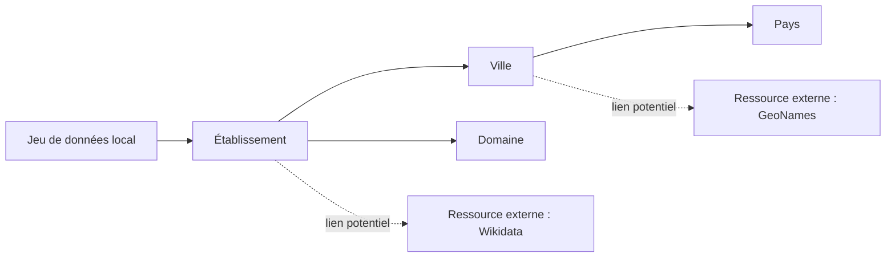

# Carte des entités et des liens potentiels

## 1. Inventaire des entités

| Entité ou type d'entité | Exemple local | Pourquoi s'agit-il d'une entité ? | Attributs associés | Identifiant local potentiel |
| --- | --- | --- | --- | --- |
|  |  |  |  |  |
|  |  |  |  |  |
|  |  |  |  |  |

## 2. Relations conceptuelles observées

| Source | Relation conceptuelle | Cible | Cardinalité | Commentaire |
| --- | --- | --- | --- | --- |
|  |  |  |  |  |
|  |  |  |  |  |
|  |  |  |  |  |

## 3. Liens externes proposés

| Entité locale | Ressource externe candidate | Type de lien envisagé | Critères d'appariement | Justification | Bénéfice attendu | Niveau de confiance | Risque |
| --- | --- | --- | --- | --- | --- | --- | --- |
|  |  |  |  |  |  |  |  |
|  |  |  |  |  |  |  |  |
|  |  |  |  |  |  |  |  |

## 4. Schéma conceptuel

Vous pouvez insérer ici :

- une capture d'écran d'un schéma
- ou un diagramme Mermaid

Exemple Mermaid purement conceptuel :

## 5. Analyse critique

- Quels liens vous paraissent les plus fiables ?
- Quels liens restent incertains ?
- Quelles informations supplémentaires faudrait-il pour automatiser les correspondances ?
- Quelles entités devraient recevoir un identifiant stable en priorité ?
- Quels risques de faux positifs ou de collisions d'identifiants avez-vous identifiés ?
